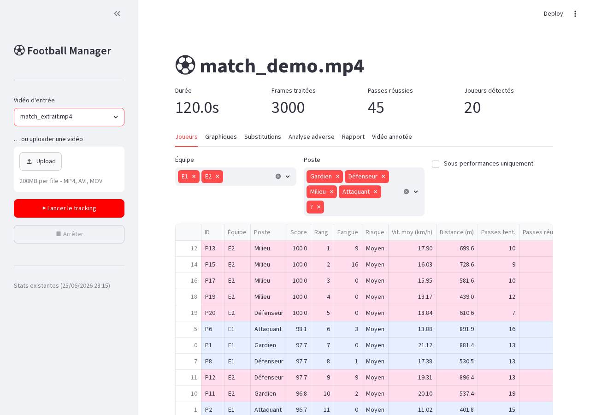
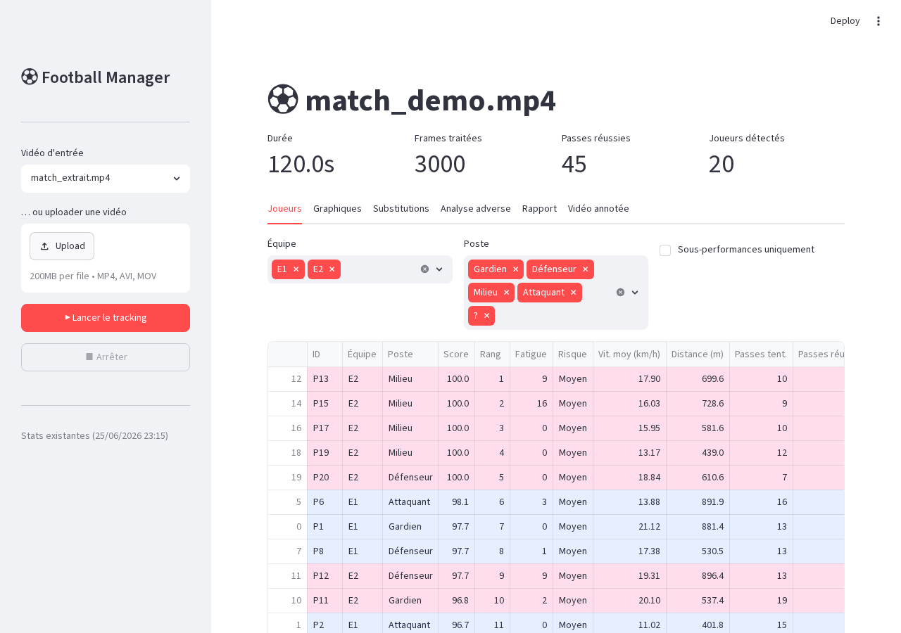
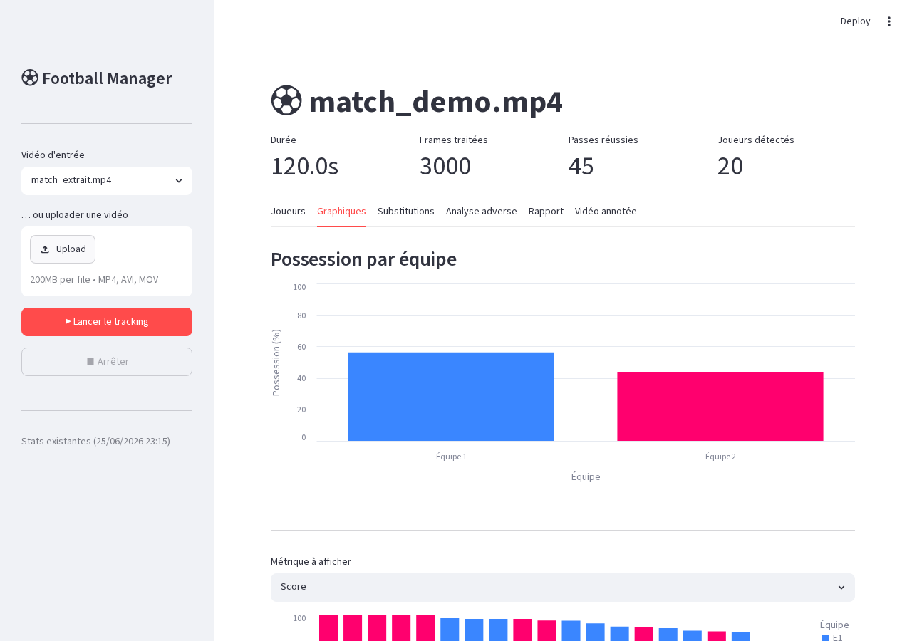
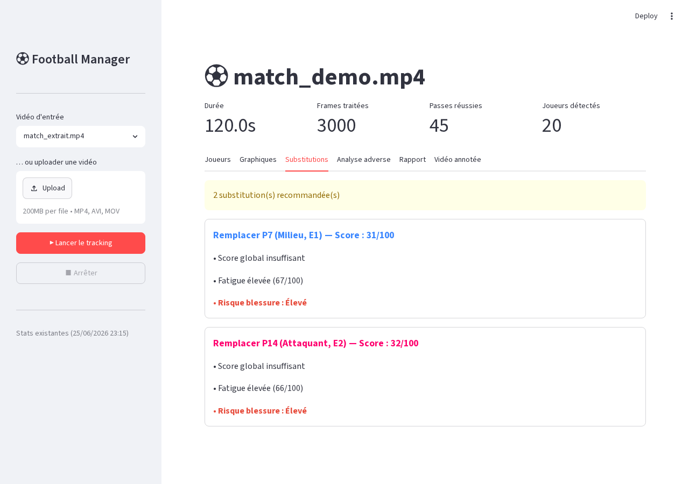
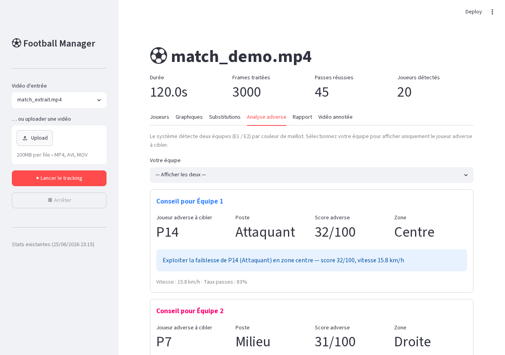
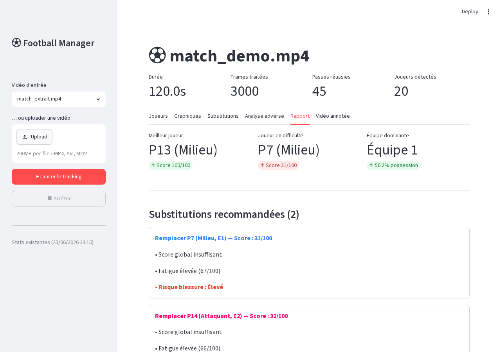

# Football Decision Intelligence AI

Un assistant tactique intelligent qui analyse automatiquement des vidéos de match de football pour aider un entraîneur à prendre de meilleures décisions — substitutions, analyse adverse, rapport automatique.

---

## Dashboard



**6 onglets :** Joueurs · Graphiques · Substitutions · Analyse adverse · Rapport · Vidéo annotée

---

## Fonctionnalités

### Joueurs — Statistiques en temps réel



Tableau complet : **Score** [0–100], **Rang**, **Fatigue**, **Risque blessure** (Faible / Moyen / Élevé), vitesse moyenne, distance, passes, possession. Les joueurs en sous-performance sont surlignés.

---

### Graphiques — Visualisations interactives



- Possession par équipe (E1 en bleu / E2 en rose)
- Métrique sélectionnable par joueur (Score, Vitesse, Distance, Passes, Fatigue)
- Scatter plot Vitesse × Distance
- Graphique Fatigue coloré par niveau de risque

---

### Substitutions — Recommandations avec interprétation



Chaque recommandation inclut le joueur, l'équipe, le poste, les raisons détaillées (score, fatigue, passes) et le niveau de risque de blessure coloré (vert / orange / rouge).

---

### Analyse adverse



Pour chaque équipe : joueur adverse le plus faible, son poste, sa zone sur le terrain (gauche / centre / droite) et un conseil tactique. Filtre par équipe disponible.

---

### Rapport — Export automatique



Résumé : meilleur/pire joueur, équipe dominante, substitutions, analyse adverse. Export **JSON** et **TXT** depuis l'interface.

---

## Architecture

```
Football-Manager/
├── tracking_foot.py          # Pipeline principal (boucle frame par frame)
├── app.py                    # Dashboard Streamlit (6 onglets)
├── tracking/
│   ├── config.py             # Hyperparamètres (seuils, constantes)
│   ├── state.py              # État partagé TrackingState
│   ├── field.py              # Masque terrain HSV vert
│   ├── reid.py               # ReID joueurs (algorithme Hongrois + HSV)
│   ├── team.py               # Séparation équipes k-means LAB (k=2/3)
│   ├── speed.py              # Vitesse + correction mouvement caméra
│   ├── passes.py             # Détection passes (seuil vitesse ballon)
│   ├── stats.py              # Calcul stats, fatigue, injury risk, rapport
│   └── render.py             # Annotations vidéo (labels, bounding boxes)
├── input_videos/             # Vidéos source à analyser
└── output_videos/            # Vidéos annotées + stats JSON
```

### Pipeline de traitement

```
Vidéo MP4
    ↓
YOLOv8m  ──  Détection joueurs (cl.0), ballon (cl.32), arbitre
    ↓
ByteTrack  ──  Tracking multi-objets persistant
    ↓
ReID  ──  Hungarian algorithm + similarité apparence HSV
    ↓
K-means LAB  ──  Séparation équipes (k=3, fallback k=2 si ratio >3:1)
    ↓
Phase Correlation  ──  Correction mouvement caméra
    ↓
Stats  ──  vitesse, distance, passes, possession, fatigue, injury risk
    ↓
Output : vidéo annotée H.264 + stats JSON + rapport automatique
```

---

## Installation

```bash
git clone <repo>
cd Football-Manager
python3 -m venv venv
source venv/bin/activate
pip install -r requirements.txt
```

**Dépendances principales :**

| Package | Rôle |
|---|---|
| `ultralytics` | Modèle YOLOv8 (détection + tracking) |
| `opencv-python` | Vision par ordinateur, k-means |
| `streamlit` | Dashboard web interactif |
| `altair` | Graphiques interactifs |
| `numpy / scipy` | Calculs, algorithme Hongrois |
| `reportlab` | Export rapport PDF |

---

## Utilisation

### Via le dashboard (recommandé)

```bash
source venv/bin/activate
streamlit run app.py
```

Ouvrir `http://localhost:8501` → sélectionner une vidéo → **Lancer le tracking**

L'aperçu se met à jour en temps réel pendant le traitement.

### En ligne de commande

```bash
python3 tracking_foot.py input_videos/mon_match.mp4
```

Les résultats sont sauvegardés dans `output_videos/`.

---

## Vidéos de démonstration

Deux extraits de 2 minutes inclus dans `input_videos/` :

| Fichier | Source | Caméra | Résolution |
|---|---|---|---|
| `match_tactical_camera.mp4` | Man City vs Chelsea 2022 | Caméra tactique VIP | 640×360 @ 25fps |
| `match_amateur_veo.mp4` | Match amateur 2024 | Caméra VEO automatique | 640×360 @ 30fps |

> Ces clips sont sous droits de leurs propriétaires respectifs et sont fournis uniquement à des fins de démonstration.

---

## Statistiques calculées

| Métrique | Formule |
|---|---|
| Score | `vitesse×40% + passes×30% + distance×30%` |
| Fatigue | Chute vitesse 1ère → 2ème moitié (0–100) |
| Injury Risk | `0.5×fatigue + 0.3×distance + 0.2×vitesse` |
| Poste | Variance de position X (Gardien / Défenseur / Milieu / Attaquant) |
| Possession | Frames où le joueur est ≤ 80px du ballon |
| Passes | Seuil vitesse ballon + proximité destinataire |

---

## Équipe

| Membre | Contribution |
|---|---|
| **Dao Trung-Hieu** | Acquisition des vidéos de match, codes de référence YOLOv8/ByteTrack |
| **Coulibaly Bourama** | Tests de détection, maquette YOLOv8, calibration des seuils de confiance |
| **Pierre Jean-Samuel** | Architecture modulaire du code, séparation des responsabilités, définition des statistiques |
| **Sassi Ismail** | Veille projets référence (StatsBomb, Wyscout), maquette dashboard Streamlit |
| **Chauvet Darren** | Développement principal — pipeline complet, ReID, dashboard 6 onglets, intégration |

> Chaque membre a également participé au code dans son domaine de responsabilité.

---

## Rapport de projet

Un rapport PDF complet est disponible : [`rapport_projet.pdf`](rapport_projet.pdf)

Architecture, fonctionnalités, contributions détaillées par membre, problèmes rencontrés et solutions.
